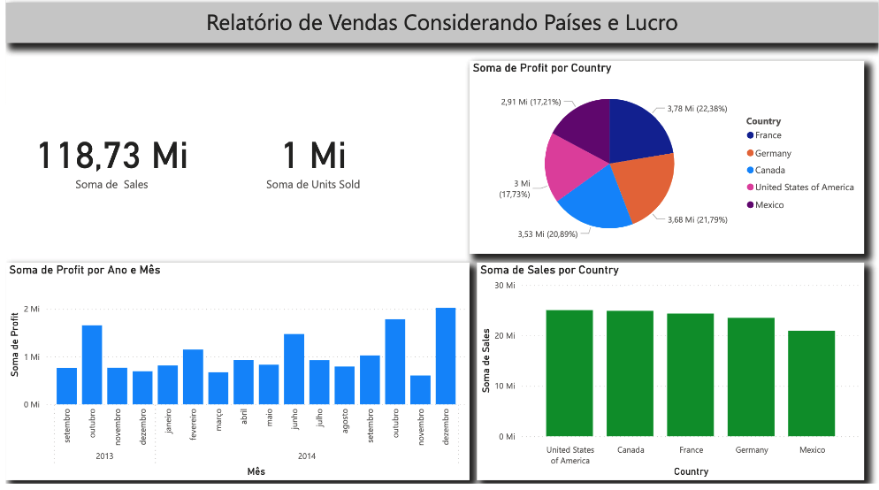
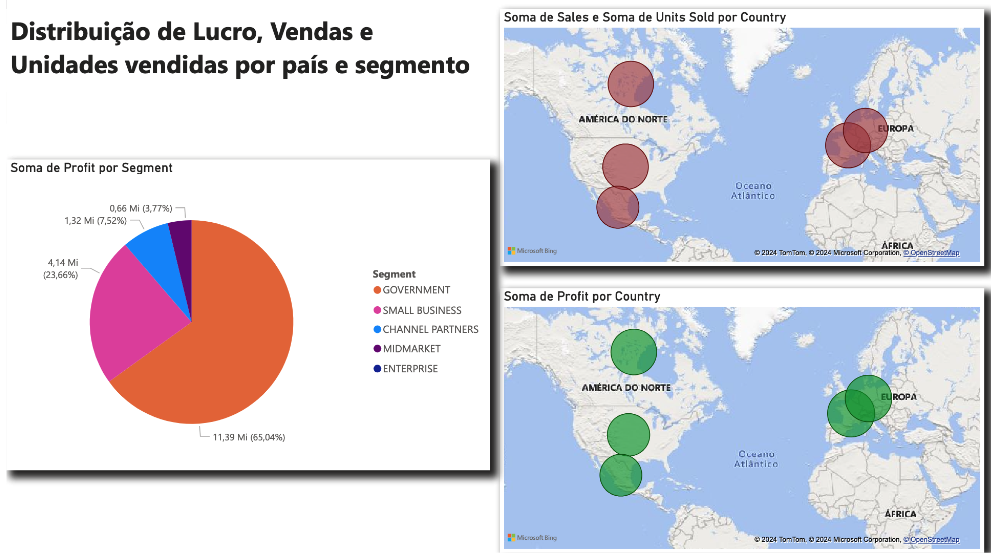

# Power BI - Analyst

[ Sobre o Projeto👨‍💻 ]

Utilizando uma base de dados de finanças robusta, me aventurei na criação de dashboards que não apenas representam os dados de forma visualmente atraente, mas também oferecem insights profundos e acionáveis. Aqui está o que consegui desenvolver:

* Dashboard de Vendas e Lucros por País: Um mapa interativo que destaca as vendas e os lucros, permitindo uma compreensão rápida das performances geográficas.
* Dashboard de Análise de Lucro por Segmento: Utilizei um gráfico de pizza para decompor o lucro por diferentes segmentos de mercado, facilitando a identificação de áreas de força e oportunidades de melhoria.
* Dashboard Personalizado: Para este, dei asas à minha criatividade e montei um dashboard que acredito ser uma peça-chave para qualquer análise financeira, combinando diversos tipos de visuais para uma análise compreensiva.

Preview 💻

